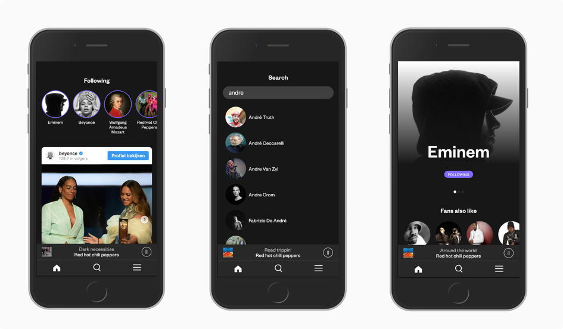

<p align="center">

</p>

<h1 align="center">Meesterproef 2019 @cmda-minor-web · 2018-2019</h1>

<p align="center"><b>Linernote brings Spotify, Youtube, articles and Social Media content from artists together in one app, supplemented by concert tickets.</b>
</p>

<br>

<p align="center">
  <a href="https://linernote.herokuapp.com/">
    
  </a>
  &nbsp;&nbsp;&nbsp;
  <a href="https://creativecommons.org/licenses/by-nc-nd/3.0/">
    
  </a>
</p> 

<br>



<br>

## Introduction
Linernote is a thought-out idea by [Joost de Boo](http://www.joostdeboo.nl). His idea of Linernote is to have one central place where you (the user) can find everything about the artists you love, in one place. You can read about his vision of Linernote on his own website: [Joost de Boo: Linernote](http://www.joostdeboo.nl/linernote), though his actual concept has changed since then.

## Table of Contents

- [Installation](#installation)
- [Design rationale](#design-rationale)
  - [Debriefing](#debriefing)
  - [Problem definition](#problem-definition)
  - [Solution](#solution)
    - [Database](#database)
    - [Authentication and Spotify](#authentication-and-spotify)
    - [Artist description](#artist-description)
    - [Social Links](#social-links)
    - [Social Media](#social-media)
    - [Articles](#articles)
    - [Tickets](#tickets)
  - [Code](#code)
- [Wishlist](#wishlist)
- [Sources](#sources)
- [License](#license)

## Installation
In order to use this application you will have to register your own named application on Spotify, Twitter, YouTube, The New York Times, Ticketmaster and Google News and set the necessary credentials in a .env file. 

Please read the [Attribution-NonCommercial-NoDerivs 3.0 Unported License (“BY-NC-ND 3.0”)](https://creativecommons.org/licenses/by-nc-nd/3.0/) before you download and use this application and/or material.

<details>
  <summary>Show me the installation steps!</summary>

1. Create an application on the [Spotify's Developer Site](https://developer.spotify.com/my-applications/).

2. Add redirect_uri in the Spotify Developer panel
```bash
http://localhost:3000/spotify/callback
```

3. Create a .env file. You can find the id and secret in the Spotify Developers panel.
```bash
REDIRECT_URI=http://localhost:3000/spotify/callback
SPOTIFY_CLIENT_ID={{client_id}}
SPOTIFY_CLIENT_SECRET={{client_secret}}
```

4. Create an application on the [Twitter Developer Site](https://developer.twitter.com/) and add the key, secret and bearer token to the .env file.
```bash
TWITTER_CONSUMER_KEY={{consumer_key}}
TWITTER_CONSUMER_SECRET={{consumer_secret}}
TWITTER_BEARER_TOKEN={{bearer_token}}
```

5. Retrieve API Keys for YouTube, The New York Times, Ticketmaster and Google News, and place them in the .env file.
```bash
YOUTUBE_API_KEY={{api_key}}
NEWYORKTIMES_API_KEY={{api_key}}
TICKETMASTER_API_KEY={{api_key}}
GOOGLENEWS_API_KEY={{api_key}}
```

6. Set a session secret in the .env file.
```bash
SESSION_SECRET={{PlaceLiterallyAnythingHere}}
```

7. Open your terminal

8. Change the directory to a folder in which you want to place the files
```bash
cd /~path
```
9. Clone the repository (you're going to need [Git](https://www.linode.com/docs/development/version-control/how-to-install-git-on-linux-mac-and-windows/))
```bash
git clone https://github.com/Mennauu/meesterproef-1819
```
10. Change directory to repository
```bash
cd meesterproef-1819
```
11. Install dependencies from [package.json](https://github.com/Mennauu/browser-technologies-1819/blob/master/package.json)
```bash
npm install
```

12. Place the .env file in the root folder

13. Run application with [Node](https://nodejs.org/en/)
```bash
node app.js
```

</details>

## Design rationale

### Debriefing
As mentioned in the introduction, Linernote is a thought-out idea by [Joost de Boo](http://www.joostdeboo.nl). His idea of Linernote is to have one central place where you (the user) can find everything about the artists you love, in one place. 

Linernote wants to show Spotify and Social Media content together with articles and tickets for events and concerts, based on the artists you love.

You can read about Joost his original vision of Linernote on his own website: [Joost de Boo: Linernote](http://www.joostdeboo.nl/linernote), though his actual concept has changed a bit since then.

### Problem definition
When you like an artist, you spend time on multiple platforms to search and gather information about the artist. Why waste time on checking different apps and websites if you could check all the content at once?

In order to show all the content from other platforms we need to have access to that content.

### Solution

8 API's are being used to retrieve content
- Spotify Web API
- Twitter API
- MusicBrainz API
- YouTube Google API
- Ticketmaster API
- MediaWiki API
- The New York Times API
- Google News API

Instagram data isn't retrieved using their official API, because you can't recieve public content from their API.

#### Database
In order to save account details and be able to follow artists, we need a **database**. The project is made using JavaScript, NodeJS and Express; [mongoDB](https://www.mongodb.com/) is a perfect database when using these tools, because MongoDB is a document database, which means it stores data in JSON-like documents. [Mongoose](https://mongoosejs.com/) is used as a boilerplate. 

#### Authentication and Spotify
In order to authenticate the user (with [OAuth 2.0](https://oauth.net/2/)) and save its account ID in the database, we use the [Spotify Web API](https://developer.spotify.com/documentation/web-api/), following the [Spotify Authorization Guide](https://developer.spotify.com/documentation/general/guides/authorization-guide/). We use spotify for the authentication process, because you need to be authenticated as a user in order to retrieve certain data from Spotify or make certain actions:

- To be able to search for artists and retrieve results
- To retrieve top tracks of concerning artist
- To retrieve related artists
- To retrieve artist images
- To retrieve information of the authenticated user
- To rertrieve information on the current song playing (in spotify from authenticated user)
- To be able to pause and play songs

The [Spotify Web API JS](https://www.npmjs.com/package/spotify-web-api-js) library is used as a wrapper for the Spotify Web API.

#### Artist description
The [Wikipedia API](https://www.mediawiki.org/wiki/API:Main_page) is used to retrieve a description of the given artist

#### Social Links
In order to get all the necessary social links of an artists we use the [Musicbrainz API](https://wiki.musicbrainz.org/Development/JSON_Web_Service). For example, when searching for Beyonce the API returns the URL: https://www.instagram.com/beyonce/ as the instagram social link.

#### Social Media
Since we have the social links, we need to retrieve the most recent posts or upload from each platform; Instagram, Twitter and YouTube.

> **Instagram**<br>
Instagram doesn't have an API where you can retrieve public data from a given user. However, if you add <i>?__a=1</i> after the Instagram Social Link, it returns all the data of that given user. We fetch the data from that link and search for the URL shortcode from the latest post, which is used to embedd the post within Linernote.

> **Twitter**<br>
To retrieve the latest Twitter post of a given user you have to create a [developer account at Twitter](https://developer.twitter.com/) and get verified for your project. As soon as you are verified (and retrieved a key, secret and token) you can use the Twitter API to retrieve the URL shortcode from the latest feed post of a given user, which is used to embedd the post within Linernote.

The [Twitter for Node.js](https://www.npmjs.com/package/twitter) library is used as a wrapper for the Twitter API.

> **YouTube**<br>
To retrieve the latest YouTube upload of a given user you have to sign up at Google and retrieve an API key. You can then use the [YouTube Google API v3](https://developers.google.com/youtube/) to search for a playlist with all uploaded videos - you have to filter out the latest one.

#### Articles
We get articles from two sources: The New York Times and Google News.

> **The New York Times**<br>
In order to use the [API from The New York Times](https://developer.nytimes.com/apis) you need to create a project on their [developer website](https://developer.nytimes.com/). After creation you will retrieve an API key with which you can search for articles from The New York Times based on the name of the artist.

> **Google News**<br>
Google News gets their articles from 30.000 sources all over the internet. In order to use the [Google News API](https://newsapi.org/s/google-news-api) you have to create a new account and request an API key. With the API key you can search in their database for the most recent articles based on the name of the artist.

#### Tickets
To show events and concerts from artists, we use the [Ticketmaster API](https://developer.ticketmaster.com/). You have to create an account to get an API key in order to use their API. The results are based on the name of an artist. For monetization you need a business verified API key.

### Code
Linernote is created using HTML, SCSS, JavaScript, Handlebars, NodeJS, Express, MongoDB and SocketIO.

The code consists of 600+ lines of HTML(and handlebars), 800+ lines of JavaScript and 1000+ lines of SCSS.

<details>
  <summary>Show me some code!</summary>

<br>

**SCSS**<br>
SCSS is used to write component based CSS. Let's take the Spotify Player as an example. 

```SCSS
.spotify {
  position: fixed;
  bottom: 50px;
  height: 50px;
  background-color: $black-light;
  z-index: 10;
  width: 100%;
  border-bottom: 1px solid $gray-dark;
  color: $white;
  display: flex;
  align-items: center;
  padding: 0 1em;

  &__progress {
    width: 1px;
    height: 3px;
    background: $white;
    transition: width .1s linear;
    visibility: hidden;
  }

  &__image {
    width: 30px;
    height: 30px;
    margin-right: 1em;
  }

  &__song {
    text-align: center;
    width: 100%;
    display: flex;
    justify-content: center;
    flex-direction: column;
    overflow: hidden;
  }

  &__artist {
    display: inline-block;
    text-transform: lowercase;

    &::first-letter {
      text-transform: uppercase;
    }
  }

  &__track {
    color: $gray;
    text-transform: lowercase;
    text-overflow: ellipsis;
    overflow: hidden;
    white-space: nowrap;

    &::first-letter {
      text-transform: uppercase;
    }
  }

  &__remote {
    height: 30px;
    min-width: 30px;
    border: 1px solid $white;
    border-radius: $rounded;
    margin-left: 1em;
    display: flex;
    align-items: center;
    justify-content: center;
    transition: 0.2s;
    cursor: pointer;
    -webkit-font-smoothing: antialiased;
    text-rendering: optimizeLegibility;
    -moz-osx-font-smoothing: grayscale;
  }

  &__id {
    display: none;
  }

  &__refresh {
    display: flex;
    width: calc(100% - 3em);
    align-items: center;
  }
}
```
**Handlebars**<br>
Handlebars are used to build semantic templates. I can use a layout for multiple views; two layouts are created while there are 4 views. Lets take the Authentication Layout as an example with the Login view.

_**Authentication Layout**_
```handlebars
<!DOCTYPE html>
<html lang="en">

  <head>
    <meta charset="utf-8">
    <meta content="width=device-width, initial-scale=1, viewport-fit=cover" name="viewport">
    <title>Linernote</title>
    <meta name="description"
      content="Linernote brings Spotify, Youtube, articles and Social Media content from artists together in one app, supplemented by concert tickets.">
    <link rel="icon" type="image/png" href="/images/favicon.png">
    <link rel="stylesheet" href="/css/styles.css">
    <link rel="stylesheet" href="https://fonts.googleapis.com/css?family=Nunito+Sans:300,400,700,900">
  </head>

  <body class="{{template}}">
    {{{body}}}
  </body>

</html>
```

_**Login view**_
```handlebars
<div class="authentication">
  
  <p class="authentication__description">Linernote brings Spotify, 
    Youtube, articles and Social Media content from artists together 
    in one app, supplemented by concert tickets.</p>
  <a href="/spotify/login" class="button button--spotify">Login with spotify</a>
  <small class="authentication__note">Note: you need a <a
      href="https://www.spotify.com/nl/premium/?checkout=false">premium
      account</a></small>
</div>
```

**MongoDB**<br>
MongoDB is used to setup the database (based on Mongoose). The only things necessary are connecting to the database, and being able to add a user to it with a record (array in this case) in which the id's of the (followed) artists can be placed.


```JavaScript
class Database {
  constructor() {
    this._connect()
  }

  _connect() {
    mongoose.connect(uristring, { useNewUrlParser: true })
      .then(() => {
        console.log('Database connection successful: ' + uristring)
      })
      .catch(err => {
        console.error('Database connection error: ' + uristring)
      })
  }
}
```

```JavaScript
const userSchema = new mongoose.Schema({
  user: String,
  following: []
})
```

**SocketIO**<br>
SocketIO is used to be able to load the page without having to wait for all the API calls to return with data. The page can be openend nearly instant, with a loading state for the data. Sockets are also used to poll the Spotify API every couple of seconds to retrieve the current playing song from the authenticated user. The front-end will update as soon as a **new** song gets polled.

```JavaScript
io.on("connect", socket => {
  getPlayBackState(socket)

  socket.on('artist-name', async (name) => {
    socket.emit('artist-data', await getArtistData(name))
  })
  socket.on('following-list', async (data) => {
    socket.emit('artist-data', await getMultipleArtistData(data.followList, data.token))
  })
})
```

</details>

## Wishlist
- [ ] Add feed filtering
- [ ] Add two line support for artist name on artist page
- [ ] Add offline data support (localStorage or serviceWorker)
- [ ] Infinite scrolling (for more content)
- [ ] Ability to swipe any feed item to the left to show some keywords and sharing options for that particular feed item.
- [ ] If possible, when clicking on a song from the top tracks, play it on Spotify.
- [ ] Convert to Progressive Web App (PWA)

## Sources
Underneath you will find some sources that have been helpful while creating Linernote.

- 📖: Documentation or article
- 🛠: Tool or library

> * 🛠 [Twitter for Node.JS](https://www.npmjs.com/package/twitter)
> * 🛠 [Cookie parser](https://www.npmjs.com/package/cookie-parser)
> * 🛠 [Dotenv](https://www.npmjs.com/package/dotenv)
> * 🛠 [Esm](https://www.npmjs.com/package/esm)
> * 🛠 [Express](https://www.npmjs.com/package/express)
> * 🛠 [Express Handlebars](https://www.npmjs.com/package/express-hbs)
> * 🛠 [NodeJS Library for Facebook](https://www.npmjs.com/package/fb)
> * 🛠 [Genius API client](https://www.npmjs.com/package/genius-api)
> * 🛠 [HTTP](https://www.npmjs.com/package/http)
> * 🛠 [Mongoose](https://www.npmjs.com/package/mongoose)
> * 🛠 [MusicBrainz API-client](https://www.npmjs.com/package/musicbrainz-api)
> * 🛠 [Node fetch](https://www.npmjs.com/package/node-fetch)
> * 🛠 [Node's querystring module](https://www.npmjs.com/package/querystring)
> * 🛠 [Socket.io](https://www.npmjs.com/package/socket.io)
> * 🛠 [Spotify Web API Node](https://github.com/thelinmichael/spotify-web-api-node)
> * 🛠 [Heroku](https://www.heroku.com/)
> * 🛠 [Handlebars](https://handlebarsjs.com/builtin_helpers.html)
> * 🛠 [Sass](https://sass-lang.com/)
> * 🛠 [HTML5 symbols](https://dev.w3.org/html5/html-author/charref)

> * 📖 [Twitter Developer API](https://developer.twitter.com/)
> * 📖 [The New York Times Developer Network](https://developer.nytimes.com/)
> * 📖 [Spotify Web API](https://developer.spotify.com/documentation/web-api/)
> * 📖 [How to send two variables in one message using Socket.io](https://stackoverflow.com/a/20632638/1300427)
> * 📖 [Get value of a string after a slash in JavaScript](https://stackoverflow.com/a/8376542/1300427)
> * 📖 [YOU MIGHT NOT NEED JQUERY](http://youmightnotneedjquery.com/)
> * 📖 [Dynamically load JS inside JS](https://stackoverflow.com/a/14521482/1300427)
> * 📖 [Using Handlebars on the server and client](http://tilomitra.com/handlebars-on-the-server-and-client/)
> * 📖 [Document cookie](https://developer.mozilla.org/en-US/docs/Web/API/Document/cookie)
> * 📖 [MusicBrainz API](https://wiki.musicbrainz.org/Development/JSON_Web_Service)
> * 📖 [Google News API](https://newsapi.org/s/google-news-api)
> * 📖 [Ticketmaster API](https://developer.ticketmaster.com/products-and-docs/apis/getting-started/)
> * 📖 [Wikipedia API](https://www.mediawiki.org/wiki/API:Main_page/nl)
> * 📖 [YouTube API](https://developers.google.com/youtube/)
> * 📖 [Socket io docs](https://socket.io/docs/)

<!-- How about a license here? 📜 (or is it a licence?) 🤷 -->
## License 
<a href="https://creativecommons.org/licenses/by-nc-nd/3.0/" rel="nofollow">
  
</a>